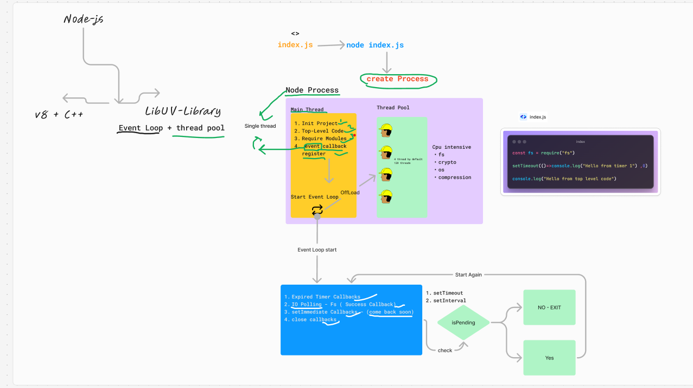

# Node.js Execution Process



## How Node.js Executes Your Code

When you run `node index.js`:

1. **Node Process Creation**
   - Creates a "Node Process" (instance of your program)
   - Runs on the **Main Thread** (single thread for JavaScript execution)

2. **Execution Phases** (in order):

### Phase 1: Initialization
- Prepares the environment
- Sets up memory space

### Phase 2: Top-Level Code Execution
Executes all code NOT inside callbacks:
```javascript
console.log('This runs immediately'); // Executed
fs.writeFileSync('file.txt', 'data'); // Executed (blocking)
setTimeout(() => {}, 1000); // Only registers the timer
```

### Phase 3: Module Loading
- Processes all `require()` statements
- Caches loaded modules

### Phase 4: Event Callback Registration
- Sets up listeners for:
  - Timers (`setTimeout`, `setInterval`)
  - I/O operations (file system, network)
  - System events

## The Event Loop (After Initial Execution)

### Priority Order:
1. **Expired Timer Callbacks** (`setTimeout`, `setInterval`)
2. **I/O Polling** (File system, network operations)
3. **setImmediate Callbacks**
4. **Close Callbacks** (cleanup events)

### Event Loop Rules:
- Checks if any tasks are pending
- If yes, starts the cycle again
- If no, process exits

## Thread Pool (libuv)
- **4 Worker Threads** by default (configurable)
- Handles:
  - File system operations (FS module)
  - CPU-intensive tasks
  - DNS lookups

## Key Concepts

| Term           | Description                          |
|----------------|--------------------------------------|
| Main Thread    | Single thread where JS executes      |
| Worker Threads | Handle heavy operations (default: 4) |
| Event Loop     | Checks and executes pending tasks    |
| Callback Queue | Holds completed async operations     |

## Example Flow
```javascript
// 1. Top-level execution
console.log('App started');

// 2. Async operation (registered)
fs.readFile('data.txt', (err, data) => {
  // This executes in I/O phase
  console.log('File read complete');
});

// 3. Timer registration
setTimeout(() => {
  console.log('Timer fired');
}, 1000);

// Event loop begins after this...
```

> **Note**: While JavaScript runs single-threaded, Node.js uses libuv's thread pool to handle potentially blocking operations.
```