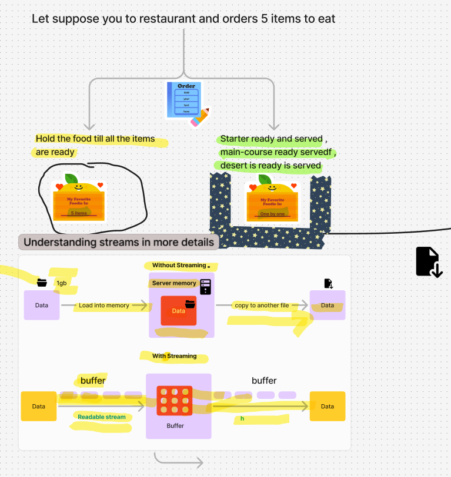

# Understanding Streams in Programming

Streams are a fundamental concept in computer programming for handling data transfer efficiently. Let me explain this in more detail:



## Definition
A stream is a method for transferring large amounts of data from one point to another by breaking it into smaller, manageable chunks (called buffers) rather than handling it all at once.

## Real-world Analogy (Restaurant Example)
- **Case 1 (No streaming)**: The chef prepares all 5 courses completely before serving anything to the customer. The customer waits a long time and needs a big table to hold all food at once.
- **Case 2 (With streaming)**: The chef serves each course as soon as it's ready. The customer gets food faster and only needs space for one course at a time.

## Technical Implementation

### Without Streams
1. You have a 1GB file to copy
2. The entire file loads into server RAM first
3. Then it gets written to the destination
4. Problems:
   - High memory usage (needs 1GB+ RAM)
   - Slower for large files
   - Doesn't scale well with multiple users/files

### With Streams
1. The file is read in small chunks (buffers)
2. Each chunk is processed and written immediately
3. Benefits:
   - Low memory usage (only needs buffer size)
   - Faster transfer (can start writing immediately)
   - Scalable for many users/files
   - Enables features like progress tracking

## Buffer Characteristics
- A buffer is a temporary storage area in memory
- No fixed maximum/minimum size (but often defaults to 64KB in Node.js)
- Can be customized based on needs
- YouTube's "loading" is buffer filling with video chunks

## Stream Types
1. **Readable Stream**: Source of data (like reading a file)
2. **Writable Stream**: Destination for data (like writing to a file)
3. **Duplex Stream**: Both readable and writable
4. **Transform Stream**: Modifies data as it passes through

Streams are used everywhere in computing: video streaming, file transfers, network communications, and even in-memory data processing.

# Node.js Streams: Comprehensive Guide

## Table of Contents
1. [Introduction to Streams](#introduction-to-streams)
2. [Why Use Streams?](#why-use-streams)
3. [Streams vs Buffers](#streams-vs-buffers)
4. [Types of Streams](#types-of-streams)
5. [Working with HTTP Streams](#working-with-http-streams)
6. [File Operations with Streams](#file-operations-with-streams)
7. [Custom Streams](#custom-streams)
8. [Transform Streams](#transform-streams)
9. [Piping Streams](#piping-streams)
10. [Error Handling](#error-handling)
11. [Best Practices](#best-practices)

---

## Introduction to Streams

Streams are collections of data that might not be available all at once and don't have to fit in memory. They are especially useful for:

- Processing large datasets
- Handling continuous data flows
- Efficient memory usage
- Real-time data processing

**Key Concept**: Streams process data in chunks (buffers) rather than loading entire resources into memory.

---

## Why Use Streams?

### Memory Efficiency
- Traditional approach loads entire file into memory
- Streams process data in small chunks (default 64KB in Node.js)

### Time Efficiency
- Processing can begin immediately without waiting for entire payload
- Better for real-time applications

### Scalability
- Handles large files that might exceed memory limits
- Supports multiple simultaneous operations

**Example**: Streaming a 1GB file:
- Without streams: Needs 1GB+ RAM
- With streams: Needs only buffer size (e.g., 64KB)

---

## Streams vs Buffers

| Feature        | Buffer                          | Stream                          |
|----------------|---------------------------------|---------------------------------|
| Memory Usage   | Holds complete data in memory   | Processes data in small chunks  |
| Processing    | All-at-once                     | Piece-by-piece                  |
| Use Case      | Small data                      | Large or continuous data       |
| Performance   | Faster for small data           | Better for large data           |

**Buffer**: Temporary storage in memory that holds streamed data chunks.

---

## Types of Streams

1. **Readable Streams**  
   - Source of data (e.g., file read, HTTP request)
   - Example: `fs.createReadStream()`

2. **Writable Streams**  
   - Destination for data (e.g., file write, HTTP response)
   - Example: `fs.createWriteStream()`

3. **Duplex Streams**  
   - Both readable and writable (e.g., TCP socket)

4. **Transform Streams**  
   - Special duplex stream that modifies data
   - Example: Compression, encryption streams

---

## Working with HTTP Streams

### Bad Approach (Without Streams)
```javascript
// ❌ Memory-intensive
const file = fs.readFileSync("sample.txt");
res.end(file);
```

### Good Approach (With Streams)
```javascript
// ✅ Memory-efficient
const readableStream = fs.createReadStream("sample.txt");
readableStream.pipe(res); // Pipes data directly to response
```

**Benefits**:
- Doesn't load entire file into memory
- Starts sending data immediately
- Handles backpressure automatically

---

## File Operations with Streams

### Copying Files

#### Bad Approach
```javascript
// ❌ Reads entire file first
const file = fs.readFileSync("sample.txt");
fs.writeFileSync("output.txt", file);
```

#### Good Approach
```javascript
// ✅ Streams chunks
const readStream = fs.createReadStream("sample.txt");
const writeStream = fs.createWriteStream("output.txt");

readStream.pipe(writeStream);
```

**Event-based Alternative**:
```javascript
readStream.on("data", (chunk) => {
  writeStream.write(chunk);
});
```

---

## Custom Streams

### Creating Readable Stream
```javascript
const { Readable } = require("stream");

const readableStream = new Readable({
  read(size) {
    // Custom read implementation
  }
});

readableStream.push("Data");
```

### Creating Writable Stream
```javascript
const { Writable } = require("stream");

const writableStream = new Writable({
  write(chunk, encoding, callback) {
    console.log("Writing:", chunk.toString());
    callback();
  }
});
```

---

## Transform Streams

Modify data as it passes through the stream:

```javascript
const { Transform } = require("stream");

const transformStream = new Transform({
  transform(chunk, encoding, callback) {
    const modified = chunk.toString()
      .toUpperCase()
      .replace(/ipsum/gi, "Hello");
    callback(null, modified);
  }
});
```

**Usage**:
```javascript
readStream.pipe(transformStream).pipe(writeStream);
```

---

## Piping Streams

Piping connects streams together automatically handling:
- Data flow
- Backpressure
- Error propagation

### Basic Pipe
```javascript
source.pipe(destination);
```

### Pipeline Method (Better Error Handling)
```javascript
const { pipeline } = require("stream");

pipeline(
  readStream,
  transformStream,
  writeStream,
  (err) => {
    if (err) console.error("Pipeline failed", err);
    else console.log("Pipeline succeeded");
  }
);
```

**Benefits over `.pipe()`**:
- Proper error handling
- Cleaner code
- Automatic stream cleanup

---

## Error Handling

Always handle stream errors:
```javascript
readStream.on("error", (err) => {
  console.error("Read error:", err);
});

writeStream.on("error", (err) => {
  console.error("Write error:", err);
});
```

**With Pipeline**:
```javascript
pipeline(
  readStream,
  transformStream,
  writeStream,
  (err) => {
    if (err) {
      console.error("Error in pipeline:", err);
    } else {
      console.log("Processing complete");
    }
  }
);
```

---

## Best Practices

1. **Always handle errors** - All streams can emit errors
2. **Use `pipeline` instead of `pipe`** - Better error handling
3. **Consider backpressure** - Don't overwhelm consumers
4. **Destroy streams properly** - Avoid memory leaks
5. **Use highWaterMark wisely** - Controls buffer size
6. **Prefer streaming APIs** - Especially for large data
7. **Consider object mode** - For non-buffer data (set `objectMode: true`)

**Example with Backpressure**:
```javascript
const readable = fs.createReadStream("source.txt");
const writable = fs.createWriteStream("dest.txt");

readable.on("data", (chunk) => {
  if (!writable.write(chunk)) {
    readable.pause(); // Handle backpressure
  }
});

writable.on("drain", () => {
  readable.resume();
});
```

---

## Conclusion

Streams are powerful Node.js primitives that enable:
- Efficient memory usage
- Real-time processing
- Scalable applications
- Clean data transformation pipelines

Mastering streams will significantly improve your Node.js applications, especially when working with:
- Large files
- Network communications
- Data transformations
- Real-time systems